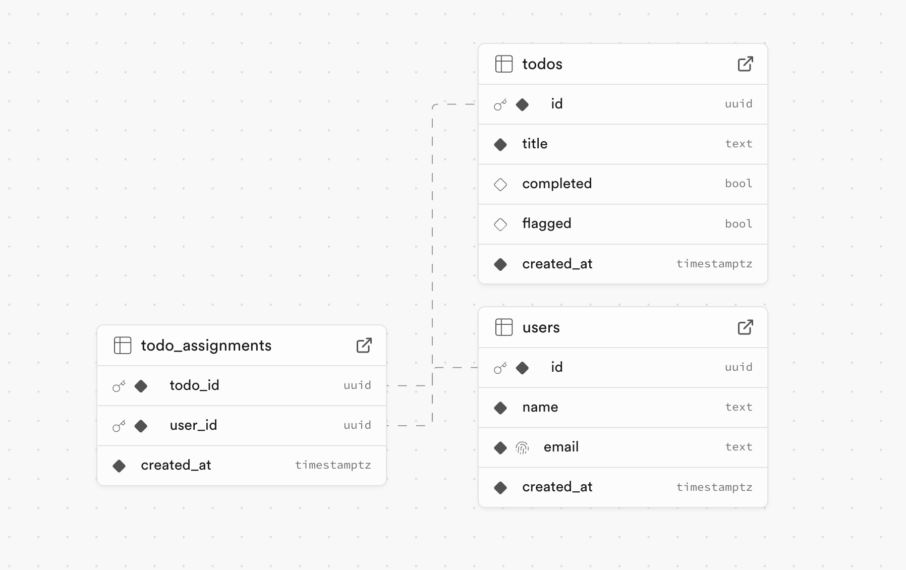

# Kaizen GraphQL Todo Application

**Demo Link:** [https://graph-ql-project-mauve.vercel.app/](https://graph-ql-project-mauve.vercel.app/)

This is a full-stack Todo application built with Next.js, Apollo Client, and Supabase. The application allows users to manage todos and assign them to different users. It leverages GraphQL for data fetching and mutations.

## Features

- **User Management**: Create, update, and delete users.
- **Todo Management**: Create, update, delete, and assign todos to users.
- **GraphQL API**: Utilizes Apollo Server and Client for seamless data operations.

## Prerequisites

- Node.js (v18 or later)
- Supabase account and project

## Installation

1. **Clone the repository**:

   ```bash
   git clone https://github.com/kinan-kaizentech/GraphQL-Project
   cd GraphQL-Project
   ```

2. **Install dependencies**:

   ```bash
   npm install
   ```

3. **Set up environment variables**:
   Create a `.env.local` file in the root directory and add your Supabase credentials:

   ```env
   NEXT_PUBLIC_SUPABASE_URL=your-supabase-url
   NEXT_PUBLIC_SUPABASE_ANON_KEY=your-supabase-anon-key
   ```

4. **Run the development server**:

   ```bash
   npm run dev
   ```

   Open [http://localhost:3000](http://localhost:3000) with your browser to see the result.

## Usage

- **Todos Page**: Manage your todos, mark them as completed, flagged, or delete them. Assign users to todos for better task management.
- **Users Page**: Manage users, create new users, and view todos assigned to each user.

## Project Structure

- **Frontend**: Built with Next.js and Apollo Client for a seamless React experience.
- **Backend**: Utilizes Apollo Server and Supabase for data management and storage.

## Database Schema



## Useful Links

- [Next.js](https://nextjs.org/)
- [Apollo Client](https://www.apollographql.com/docs/react/)
- [Supabase](https://supabase.io/)
